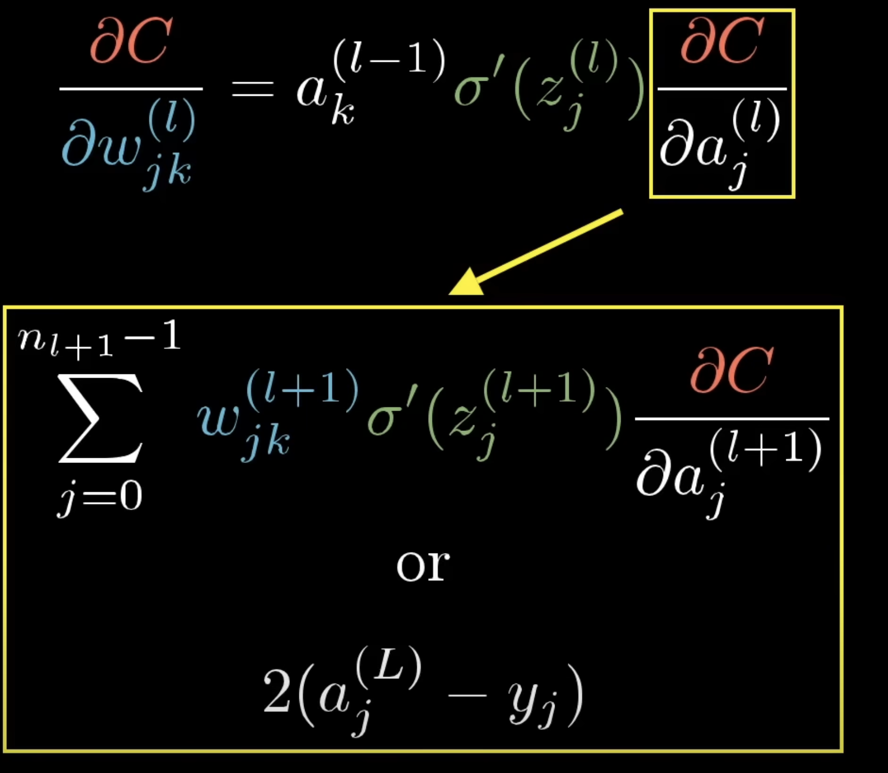

# Backpropagation

## Neuron

A single Neuron of a Neural Network (NN) is defined as:

$a = act((\sum_{0}^{n-1} w_{n}i_{n}) + b)$

Where $w_n$ is a weight value, $i_n$ is an input value, $b$ is a bias value, $act(x)$ is a non-linear function such as Sigmoid or ReLU, and `a` is the final activation of the Neuron.

Put simply, neuron's can take multiple numbers as input, and can only output a single number called the activation. The activation is calculated based on these input numbers, some weights which are mapped to each input, and a single bias value.

If it was a function in code, it's signature would looks like so:

```cpp
float neuron_forward(float* inputs);
```

If we were to use just this to learn from data, we would call this a Perceptron. A common toy task for training a Perceptron is the XOR operation.

## Layer

To build more complex networks, we can link many Neurons together using a Multi-Layer Perceptron (MLP) a.k.a Feed Forward Network (FFN).

A building block of an MLP is a Layer. A single layer can consist of many Neurons, how many is determined by how many outputs the layer is required to have.

For example if we want a layer that takes 5 values and outputs 2 values, we will need two Neurons in the layer, and each of the Neurons will need to take 5 values.

The output of the layer are the activations of the Neurons inside the layer. As the name suggests, an MLP is just a collection of layers, where the outputs of each layer are connected to the inputs of all neurons in the subsequent layer. In our toy example above, the subsequent layer's neuron's would each have to take two inputs (as their are two outputs of the initial layer).

The process of feeding numbers into the inputs of the initial layer, getting the activations and feeding them into the inputs of the next layer until there are no layers left is known as the Forward Pass.

If it was a function in code, it's signature would look like so:

```cpp
float* layer_forward(float* inputs);
```

## Cost / Loss Function

To train a NN, either perceptron or MLP, we first need to define a cost/loss function. This function gives a numerical indication of how well the network is doing at completing its task.

One such function is known as Mean Squared Error (MSE Loss) defined as:

$MSE_{Loss} = (a - label)^2$

Where $a$ is one of the final activations of the network and $label$ is the expected output of the network (provided by the training dataset).

The objective of the NN will be to minimise this value as much as possible given the training data and hyperparameters (configuration of the network itself and it's training proces) provided.

The loss function chosen must be differentiable, as we'll need to use the gradient of this function to influence how we change the weights of the model to better fit the data.

## Calculating the Gradient

To minimise the loss function we need to change the weights and biases of the model in such a way that the change should result in a reduction in loss on the next forward pass. To do this we need to calculate the following for each of the weights in the model:

$gradient=\frac{dL}{dw_i}$  

One way to think about it is, if we could draw Loss ($L$) vs a single weight ($w_i$) on a graph, we want to change the weight such that the Loss is at a minimum value. If we can calculate the gradient on this graph at the current value of the weight, then we get a direction value towards a local (likely) or global minimum (much less likely).

What equations do we know so far?

$L = (a - label)^2$

$a = act((\sum_{}^{n-1} w_{n}i_{n}) + b)$

Above doesn't really help us yet, we need to try build more equations to help us solve this:

$z = w_0i_0 + w_1i_1\ ...\ w_{n-1}i_{n-1} + b$

$a = act(z)$

Using those equations, we can use the Chain Rule to calculate the gradient. First we need a gradient for the Loss function. Since the Loss function is in terms of the activation and label, we will derive for the activation variant:

$\frac{dL}{da} = 2(a - label)$

Now we need to cancel out the $da$ denominator, so we derive the activation function:

$\frac{da}{dz} = delta\\_act(z)$

Where $delta\\_act(x)$ is the derivative of the non-linear activation function, so if we used Sigmoid, then it would be $delta_act(x) = x * sigmoid(x) * (1 - sigmoid(x))$.

Multiplying those two together and applying the chain rule, that would give us:

$\frac{dL}{da} * \frac{da}{dz} = \frac{dL}{dz}$

Now we need to cancel out the $dz$ denominator have it be replaced with $dw_i$, so we derive the $z$ equation in terms of $w_i$ which gives us:

$\frac{dz}{dw_i} = i_i$

Where $i_i$ is the input value from the previous layer that maps to the current weight we are updating.

Altogether we get the following formula:

$gradient = \frac{dL}{dw_i} = \frac{dL}{da} * \frac{da}{dz} * \frac{dz}{dw_i} = 2(a - label) * delta\\\_act(z) * i_i$

Now lets give each of the components required a nice name since we're programmers not mathematicians:

```python
output_gradient = delta(loss) / delta(activation)
activation_gradient = delta(activation) / delta(linear_activation)
input_activation = delta(linear_activation) / delta(weight)
```

Where `linear_activation` maps to $z$ in the formulas above.

Then to get the final gradient:

```python
gradient = output_gradient * activation_gradient * input_activation
```

This gets us the gradient for each of the weights in the final layer of the network (output layer). But what about the layers before this one?

First we change all denominators referencing $a$ and change it to $a_1$ to denote the activation of the 2nd last layer in the network.

$\frac{dL}{dw_i} = \frac{dL}{da_1} * \frac{da_1}{dz} * \frac{dz}{dw_i}$

The last two terms are trivial to calculate (re-use the formulas above), but how do we calculate the first term $\frac{dL}{da_1}$? We first need to build some equations that contain $a_1$. We can do this using the output layer.

$z = w * a_1 + b$

Or in plain english, the activation (before applying the non-linear function) of the output layer is (in-part, omitted the full equation for brevity) equal to one of the 2nd last layers outputs multiplied by one of output layer's weights.

This allows us to calculate $\frac{dz}{da_1}$:

$\frac{dz}{da_1} = w$

Where $w$ is the weight value from the output layer that corresponds to the activation $a_1$ from the 2nd last layer.

We now need a term that will cancel out the $dz$ numerator, since our goal numerator is $dL$. For this we can reuse the $\frac{da}{dz}$ value (`activation_gradient`) previously calculated for the output layer gradient calculation. Multiplying those two values together gives us:

$\frac{dz}{da_1} * \frac{da}{dz} = \frac{da}{da_1}$

Now we need a term that will cancel at $da$ and replace it with $dL$. For this we can again reuse terms from the output layer gradient calculation, this time we use the $\frac{dL}{da}$ value (`output_gradient`). Finally giving us what we need:

$\frac{dL}{da_1} = w * \frac{da}{dz} * \frac{dL}{da}$

Or in code:

```python
output_gradient = (
  weight_from_next_layer * 
  activation_gradient_from_next_layer * 
  output_gradient_from_next_layer
)
```

Then the final gradient calculation for the layer before the output layer looks like:

```python
gradient = (
  weight_from_next_layer * 
  activation_gradient_from_next_layer * 
  output_gradient_from_next_layer
) * activation_gradient * input_activation
```

So all we need to do for each neuron in each layer is calculate the `output_gradient` for the layer before them and pass it a long so they can update their weights accordingly.

All of this maps to the following screenshot from 3Blue1Brown (if you are more mathematically inclined):



Use the following mappings from this doc to read the above figure:

* $C$ (cost) maps to $L$ (loss)
* $j$ maps to a single neuron in the target layer being updated
* $k$ maps to a single neuron in the previous layer
* $l$ maps to a layer
* $w_{jk}$ maps to the weight value in neuron $j$ that corresponds to the activation of neuron $k$ from the previous layer.
* $\sigma'(x)$ is $delta\\_act(x)$ - the derivative function for the activation function.
* $y_j$ is the $label$ from the training data.

## Stochastic Gradient Descent (SGD)

But how do we update the weights once we have these gradients? We can use a technique called Stochastic Gradient Descent (SGD).

This is all SGD is:

$w_i = w_i - lr * \frac{dL}{dw_i}$
$b = b - lr * \frac{dL}{db}$

Where $w_i$ is a weight in a layer $lr$ is Learning Rate.

Or in code:

```python
weight -= LEARNING_RATE * gradient
bias -= LEARNING_RATE * bias_gradient
```

What is Learning Rate?
It's a hyper-parameter that controls how big each step is towards the gradient direction during training process. If we step too big we might overshoot the minimum, if too small training may take too long. The optimal value for this parameter is found by experimentation.

## Backward Pass

So for the backward pass, all we need to do is calculate a gradient for each of the weight & bias values in the network using the formula's given above, and then update them using SGD (or some other technique such as Adam).

Example code (not working code but gets the idea across):

```python
def backward_pass(self, output_gradient)
  activation_gradient = self.delta_act(self.linear_activation)
  error = output_gradient * activation_gradient
  input_gradients = [0] * self.num_inputs
  
  for weight_idx, weight in enumerate(self.weights):
    self.gradients[weight_idx] = error * self.input_activation[weight_idx]
    input_gradients[weight_idx] += error * weight

  self.bias_gradient = error

  return input_gradients
```

```python
def layer_backward_pass(self, output_gradients):
  sum_of_input_gradients = [0] * self.num_inputs
  for neuron_idx, neuron in enumerate(self.neurons):
    input_gradients = neuron.backward_pass(output_gradients[neuron_idx])
    for input_idx, gradient in enumerate(input_gradients):
      sum_of_input_gradients[input_idx] += gradient
  return sum_of_input_gradients
```

```python
def model_backward_pass(self, losses):
  output_gradients = losses
  for layer in reversed(self.layers):
    output_gradients = layer.backward_pass(output_gradients)
```

```python
def neuron_step(self):
  for weight_idx, weight in enumerate(self.weights):
    self.weights[weight_idx] -= LEARNING_RATE * self.gradients[weight_idx]
  
  self.bias -= LEARNING_RATE * self.bias_gradient
```

```python
def layer_step(self):
  for neuron in self.neurons:
    neuron.step()
```

```python
def model_step(self):
  for layer in self.layers:
    layer.step()
```

## Mini-Batch Training

Training using the entire training set to calculate the true gradient for each weight is not feasible for modern day tasks, like Large Language Models (LLM) that incorporate billions of weights and are trained on trillions of words. Therefore we must approximate the true gradient as much as we can using smaller batches of the entire training set.

The process:

* Split the training set into batches.
* For each batch do the following:
  * Run the forward pass over all of the examples in the batch.
  * Calculate the loss for each of the examples in the batch.
  * Run the backward pass over all of the examples in the batch.
    * Make sure each gradient is accumulated over the entire batch.
    * So at the end we have the mean gradient across all examples in the batch.
  * Run the optimiser step (SGD) over all of the weights using the accumulated gradients we just calculated.
